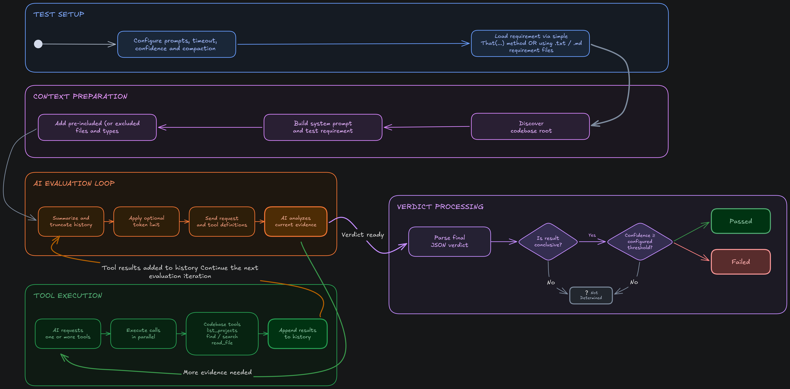

# AiAssertions

<p align="center">
	
</p>

**AiAssertions** is an AI-powered codebase assertion library.

Developers write normal unit tests, but describe business requirements in natural language.
**AiAssert** asks an AI agent to inspect the project with local tools, gather evidence, and return a verdict with model confidence and a short comment.

```csharp
[Fact]
public async Task Students_CannotModifyMarks()
{
    await AiAssert
        .OnCodebase()
        .That("""
            Students must never be able to modify
            their own marks or marks of other students.

            Only teachers and administrators
            may update marks.
            """);
}
```

## AI Test Flow
<p align="center">
	
</p>

## Installation

```
dotnet add package AiAssertions
```

## Public API

```csharp
using AiAssertions;
using AiAssertions.OpenRouter.Configuration;

AiAssert
    .Configure(OpenRouterClientFactory.Create(new OpenRouterOptions
        {
            ApiKey = Environment.GetEnvironmentVariable("OPENROUTER_API_KEY")!,
            Model = OpenRouterModel.OpenAiGpt4O
        }))
    // Timeout is a threshold for how long the model has to return a verdict.
    // If the model does not return a verdict within this time, the result verdict is NotDetermined.
    .WithDefaultTimeout(TimeSpan.FromMinutes(1)) // Optional: override default timeout for all assertions.
    .WithDefaultMaxToolIterations(300) // Optional: override default tool-calling iteration limit.
    // Confedence tolerance is a threshold for the model's confidence in its verdict. 
    // If the model returns a confidence below this threshold, the assertion fails.
    .WithGlobalConfidenceTolerance(0.85); // Optional: override default confidence tolerance for all assertions.

var result = await AiAssert
    .OnCodebase()
    .WithTimeout(TimeSpan.FromMinutes(1)) // Optional: override default timeout for this concrete assertion.
    .WithMaxToolIterations(300) // Optional: override default tool-calling iteration limit for this assertion.
    .IncludeDirectory("SampleCode/Security") // Optional: include directory as initial evidence for the model.
    .That("Business requirement in natural language.");

Console.WriteLine(result.Verdict);
Console.WriteLine(result.Confidence);
Console.WriteLine(result.Comment);

foreach (var evidence in result.Evidence)
    Console.WriteLine($"{evidence.File}:{evidence.StartLine}-{evidence.EndLine} {evidence.Description}");

foreach (var missingEvidence in result.MissingEvidence)
    Console.WriteLine($"Missing: {missingEvidence.Description}");
```

`AiAssert.OnCodebase()` uses an AI agent and native tool/function calling.

> [!NOTE]
> By default, global tolerance is not set, so AiAssertions accepts any model confidence.
>
> By default, timeout is two minutes.

`IncludeDirectory(...)`, `IncludeFile(...)`, and `IncludeType(...)` send selected files to the model as initial evidence before the agent starts calling tools.

> [!IMPORTANT]
> This pre-included evidence is intentionally capped:
> At most 20 resolved files are included.
> 
> Each included file is truncated to 30,000 characters.

The agent can still inspect additional files later through its local tools.

`WithTimeout(...)` can be applied on a codebase assertion before `That(...)` when a single assertion needs a different timeout:

```csharp
var result = await AiAssert
    .OnCodebase()
    .WithTimeout(TimeSpan.FromSeconds(30))
    .That("Students must never be able to modify their own marks.");
```

## Assert using requirements from a file

Requirements can also be stored in `.txt` or `.md` files and used instead of `.That(...)`:

```csharp
var result = await AiAssert
    .OnCodebase()
    .IncludeDirectory("SampleCode/Security")
    .AgainstRequirementFile("Requirements/password-registration.md");
```

## Make your custom AI model provider

See [Custom Models](docs/CUSTOM_MODELS.md) for the provider implementation guide.

## Existing Providers

- [OpenAi](src/AiAssertions.OpenAi/Clients/OpenAiClient.cs)
- [OpenRouter](src/AiAssertions.OpenRouter/Clients/OpenRouterClient.cs)
- [DeepSeek](src/AiAssertions.DeepSeek/Clients/DeepSeekClient.cs)
- [Anthropic](src/AiAssertions.Anthropic/Clients/AnthropicClient.cs)
- [Gemini](src/AiAssertions.Gemini/Clients/GeminiClient.cs)
- [Grok](src/AiAssertions.Grok/Clients/GrokClient.cs)

## Verdict JSON

Final codebase verdicts from AI Model must be strict JSON:

```json
{
  "passed": false,
  "confidence": 0.82,
  "is_conclusive": true,
  "reason": "UpdateMarkHandler updates marks without checking user role.",
  "evidence": [
    {
      "file": "SampleCode/School/MarksController.cs",
      "start_line": 18,
      "end_line": 25,
      "description": "MarksController exposes an update endpoint."
    }
  ],
  "missing_evidence": [
    {
      "description": "No role authorization check was found before updating marks.",
      "expected_location": "SampleCode/School/MarksController.cs"
    }
  ]
}
```

## Sample

Check the sample project: [samples/AiAssertions.Sample](samples/AiAssertions.Sample).
